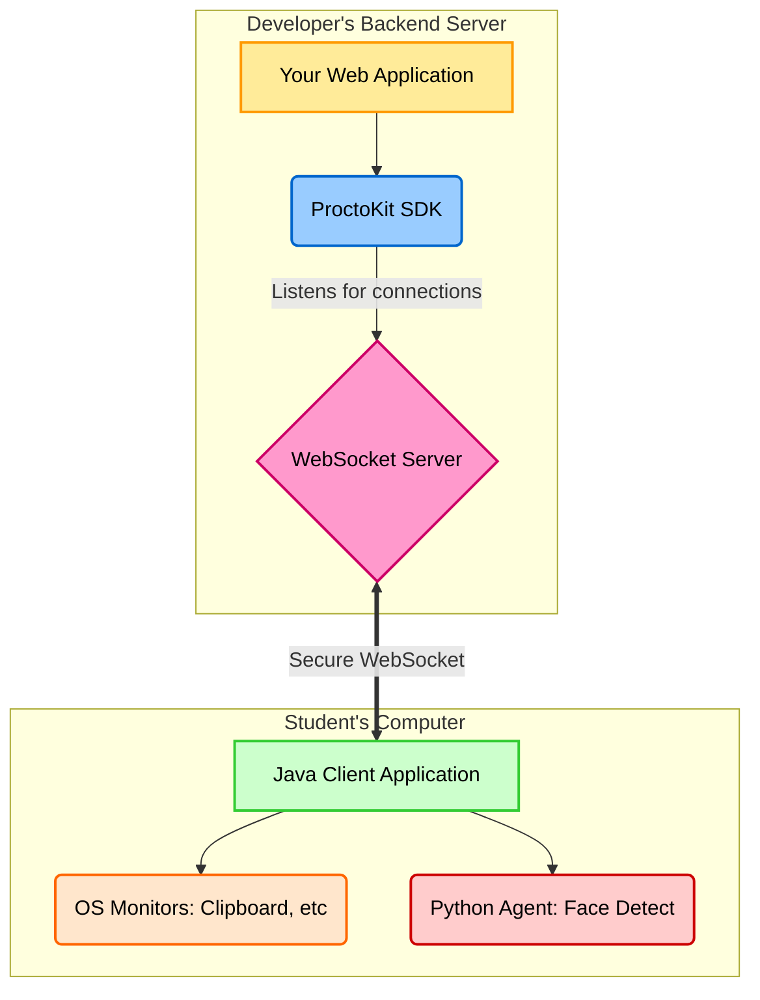

# ProctoKit: The Open-Source Proctoring Library

[](https://www.npmjs.com/package/proctokit)  
[](https://opensource.org/licenses/MIT)

**ProctoKit is a powerful, self-hosted proctoring library designed for developers to easily integrate real-time monitoring into their own online examination platforms.**

It provides a secure, two-part system: a robust server-side SDK and a lightweight, installable client for the student's machine, enabling comprehensive monitoring of the test-taking environment.

## Installation

A developer integrates the server-side SDK into their project. The student will be prompted to download and run the client installer, which you, the library creator, will host (e.g., on GitHub Releases).

### For Node.js Developers (Express, etc.)

```bash
npm install proctokit
```

### For Java Developers (Spring Boot, etc.)

Add the following dependency to your `pom.xml`:

```xml
<dependency>
    <groupId>com.proctor</groupId>
    <artifactId>sdk-java</artifactId>
    <version>1.0.0</version>
</dependency>
```
## Key Features

- **Cross-Platform Client:** A single, installable client for Windows and macOS.

- **Window & Tab Switch Detection:** Get instant alerts when a student navigates away from the test window.

- **Clipboard Monitoring:** Be notified when a student copies text.

- **Forbidden Process Tracking:** Maintain a list of forbidden applications (e.g., Discord, Slack) and get alerts if they are running.

- **AI-Powered Vision Analysis:**
  - **Face Detection:** Ensure the student is present at all times.
  - **Multiple Face Detection:** Receive a violation if more than one person is detected.
  - **Periodic Photo Capture:** Capture and receive periodic snapshots of the student for verification.

---

## How It Works: The Architecture

ProctoKit uses a secure client-server model. A developer integrates our SDK into their backend, and the student runs a small, secure client on their machine. The client performs all monitoring locally and sends violation events back to the developer's server in real-time.



## Quick Start: How to Use the SDK

Here are complete examples of how to integrate and use every function of the ProctoKit SDK.

### Node.js (Express.js Example)

```javascript
// server.js
const { ProctorSDK, ProctorConfig } = require('proctokit');

// 1. Configure the SDK with the public URLs to your client installers.
const installerLinks = {
    windows: "https://github.com/your-repo/releases/download/v1.0.0/proctor-client-setup.exe",
};
const config = new ProctorConfig(8080, '0.0.0.0', installerLinks);

// 2. Initialize the SDK.
const sdk = new ProctorSDK(config);

// 3. Set up the main event handler for new student sessions.
sdk.on('session', (session) => {
    console.log(`[SDK] New session started for: ${session.sessionId}`);

    // A. Listen for any generic event from this student.
    session.on('event', (event) => {
        console.log(`[Event] Activity: ${event.activity}, Status: ${event.status}`);
        if (event.activity === 'frameCapture') {
            // saveImageToDatabase(session.sessionId, event.details.data);
        }
    });

    // B. Listen specifically for violation events.
    session.on('violation', (violationEvent) => {
        console.error(`[VIOLATION] Student ${session.sessionId}: ${violationEvent.details.message}`);
        // flagStudentForReview(session.sessionId, violationEvent);
    });

    // C. Handle the student disconnecting.
    session.on('disconnect', () => {
        console.log(`[SDK] Session disconnected for: ${session.sessionId}`);
    });
});

// 4. Start the proctoring server.
sdk.start();

// 5. Provide the installer links to your frontend via an API.
// app.get('/api/proctoring-info', (req, res) => {
//   res.json({ installerUrls: sdk.getInstallerLinks() });
// });
```

### Java (Spring Boot / Main App Example)

```java
// MainServer.java
import com.proctor.sdk.ProctorSDK;
import com.proctor.sdk.config.ProctorConfig;
import java.util.HashMap;
import java.util.Map;

public class MainServer {
    public static void main(String[] args) {
        // 1. Configure the SDK with installer URLs.
        Map<String, String> installerLinks = new HashMap<>();
        installerLinks.put("windows", "https://github.com/your-repo/releases/download/v1.0.0/proctor-client-setup.exe");
        installerLinks.put("macos", "https://github.com/your-repo/releases/download/v1.0.0/ProctorClient-1.0.dmg");
        ProctorConfig config = new ProctorConfig(8080, "0.0.0.0", installerLinks);

        // 2. Initialize the SDK.
        ProctorSDK sdk = new ProctorSDK(config);

        // 3. Set up the event handler for new sessions.
        sdk.onSession(session -> {
            System.out.println("[SDK] New session started for: " + session.getSessionId());

            // A. Listen for all activities from this session.
            session.onActivity(event -> {
                System.out.println("[Activity] Event: " + event.toString());
                if ("frameCapture".equals(event.optString("activity"))) {
                    // saveImageToDatabase(session.getSessionId(), event.getJSONObject("details").getString("data"));
                }
            });

            // B. Listen specifically for violations.
            session.onViolation(violationEvent -> {
                System.err.println("[VIOLATION] Student " + session.getSessionId() + ": " + violationEvent.toString());
                // flagStudentForReview(session.sessionId, violationEvent);
            });

            // C. Handle disconnection.
            session.onDisconnect(() -> {
                System.out.println("[SDK] Session disconnected for: " + session.getSessionId());
            });
        });

        // 4. Start the proctoring server.
        sdk.start();
        
        // 5. Provide installer links to your frontend via an API.
        // Map<String, String> links = sdk.getInstallerLinks();
    }
}
```

## The Student Experience

The developer's frontend is responsible for guiding the student through a one-time installation of the ProctoKit client. The SDK provides all the necessary information for this.

1. The developer's website fetches the installer links from their backend using `sdk.getInstallerLinks()`.
2. The website detects the student's OS and presents them with the correct "Download for Windows/Mac" button.
3. The student downloads and runs the installer.
4. The installer performs an automated handshake with the website to start the session. No manual configuration is needed from the student.

## Contributing

We welcome contributions! Please feel free to submit a pull request or open an issue on our [GitHub repository](https://github.com/your-repo).

## License

This project is licensed under the [MIT License](https://opensource.org/licenses/MIT).
